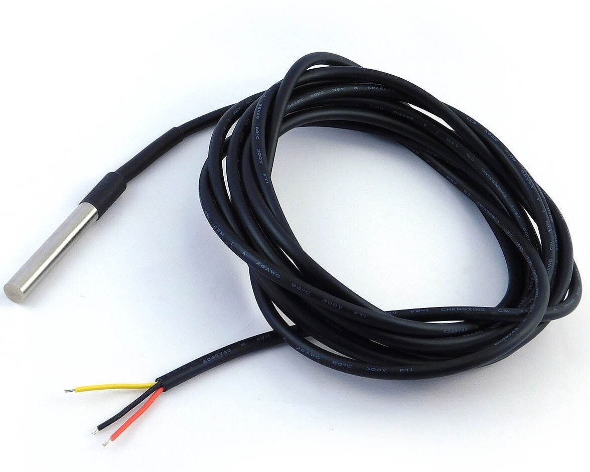
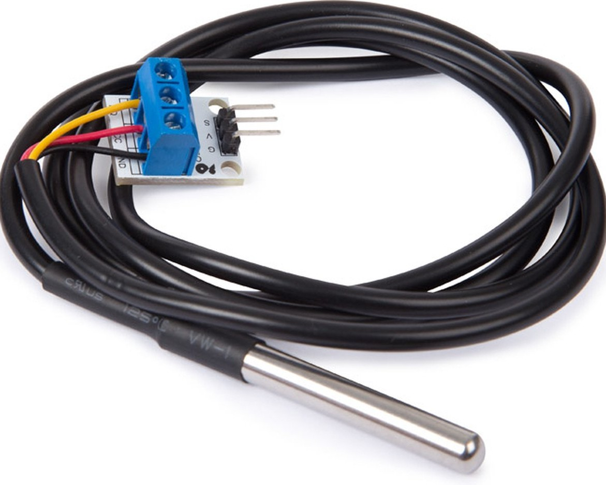
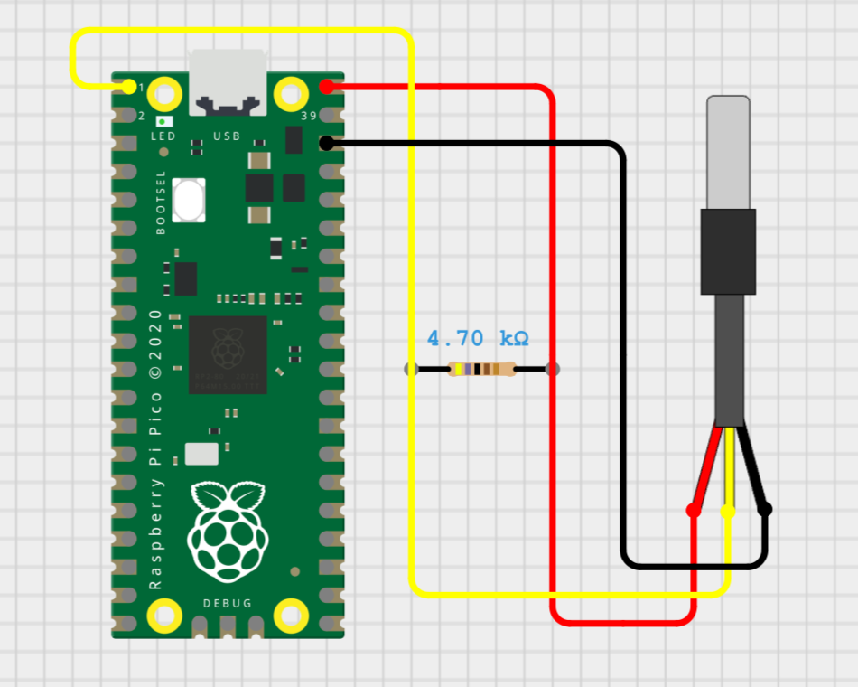
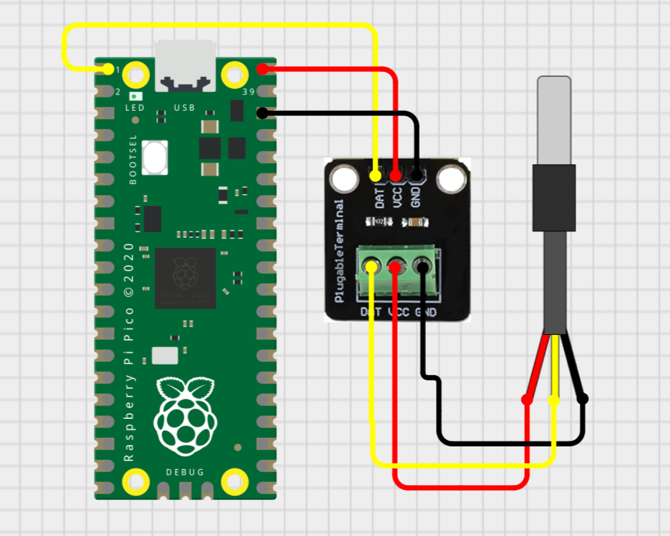

# pico-ds18b20

<a target="_blank" href="https://www.paypal.com/donate/?hosted_button_id=J65KNQYEK88ML">
  
</a>

Raspberry Pi Pico C++ library for the ds18b20 temperature sensor

## How to connect
**Note:** Does not support parasite power mode  

You first need to determine whether your ds18b20 has a built-in pull-up resistor or not. ds18b20's with built-in pull-up resistors usually have a small component connected across all three wires (ex. Keystudio ds18b20).

<table>
  <tbody>
    <tr>
      <td>
        <figure>
          <p align="center" width="300px">
            
            <figcaption><p align="center">Without built-in pull-up resistor</p></figcaption>
          </p>
        </figure>
      </td>
      <td>
        <figure>
          <p align="center" width="300px">
            
            <figcaption><p align="center">With built-in pull-up resistor</p></figcaption>
          </p>
        </figure>
      </td>
    </tr>
  </tbody>
</table>

In case your ds18b20 doesn't have a built-in pull-up resistor, you need to connect one $4.7k\Omega$ resistor across VDD and DQ yourself.

Connect:
- VDD: to 5V (ex. VBUS pin) or 3.3V (ex. 3V3 pin)
- GND: to ground (any GND pin)
- DQ: to any GPIO pin

For example:

<table>
  <tbody>
    <tr>
      <td>
        <figure>
          <p align="center" width="300px">
            
            <figcaption><p align="center">Without built-in pull-up resistor</p></figcaption>
          </p>
        </figure>
      </td>
      <td>
        <figure>
          <p align="center" width="300px">
            
            <figcaption><p align="center">With built-in pull-up resistor</p></figcaption>
          </p>
        </figure>
      </td>
    </tr>
  </tbody>
</table>

## How to run

- Download the [Embedded Temple Library (ETL)](https://github.com/ETLCPP/etl) and copy the `include` folder to the root of this project
- Compile
  ```bash
  ninja -C /home/panagiotis/pico_projects/pico-ds18b20/build
  ```
- Set the Raspberry Pi Pico in bootloader mode by connecting it through USB while pressing its button
- Load `build/ds18b20.elf` to Raspberry Pi Pico

## How to use

**See the examples folder for complete programs**

Find all the ds18b20 devices connected to GPIO 0

```c++
#include "one_wire.hpp"
#include "ds18b20.hpp"

OneWire one_wire(0);
etl::vector<Ds18b20, 10> devices = Ds18b20::find_devices(one_wire);
for (int i = 0; i < devices.size(); i++) {
    if (!devices[i].is_successfully_initialized()) {
        printf("Could not initialize device index %d. Do not use!\n", i);
    }
}

Ds18b20& device = devices[0];
// ...
```

Measure and print the temperature of a device

```c++
std::optional<float> result = device.measure_temperature();
if (result.has_value()) {
    float temperature = result.value();
    printf("%f\n", temperature);
} else {
    printf("Could not calculate temperature\n");
}
```

Set resolution

```c++
bool success = device.set_resolution(Resolution::VeryHigh, true);
if (!success) {
    printf("Could not set resolution\n");
}
```

Set the low/high alarm temperature range values

```c++
bool success0 = device.set_temperature_low_limit(-20, true);
bool success1 = device.set_temperature_high_limit(80, true);
if (!success0 || !success1) {
    printf("Could not set temperature limits\n");
}
```

Detect temperature alarms after temperature measurements

```c++
std::optional<float> result = device.measure_temperature();
if (result.has_value()) {
    if (device.is_alarm_active()) {
        printf("ALARM!!!\n");
    } else {
        printf("All safe!\n");
    }
}
```

Check if a device is operational

```c++
// ...

bool is_operational = device.ping();
if (is_operational) {
    printf("Fully operational!\n");
} else {
    printf("Device not operating correctly\n");
}
```

## Features
- Measure temperature
  - &plusmn;0.5°C from -10°C to +85°C
  - &plusmn;1°C from -30°C to +100°C
  - &plusmn;2°C from -55°C to +125°C
- Set resolution (temperature discrete step size)
  - Low: 0.0625°C steps
  - Medium: 0.125°C steps
  - High: 0.25°C steps
  - Very High: 0.5°C steps
- Detect alarm when temperature goes out of bounds
- Set the low and high bounds of the temperature alarm range
  - The range is [-128, 127] as integers
- Check if a device is operational
- Fetch the power mode of the device (external or parasite)

## Resources

- [ds18b20 Analog datasheet](https://www.analog.com/media/en/technical-documentation/data-sheets/ds18b20.pdf)
- [Book of iButton® Standards](https://www.analog.com/media/en/technical-documentation/tech-articles/book-of-ibuttonreg-standards.pdf)
- [Application Note 187 | 1-Wire Search Algorithm](https://www.analog.com/media/en/technical-documentation/app-notes/1wire-search-algorithm.pdf)